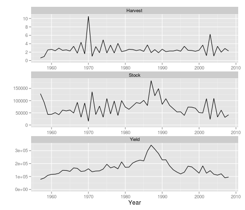

Biomass dynamic models with FLBioDym
=========================
Ispra, 18th - 22nd March, 2013
-------------------------

# Install FLBioDym


```r
install.packages("FLBioDym", repos = "http://flr-project.org/Rdevel")
```


# FLBioDym

* Pella-Tomlinson (generalizes biomass dynamic models)
    * B[t+1] = B[t] + r/p*B[t]*(1-(B[t]/k)^p)) - C[t]
    * Schaeffer with $p=1$
    * Fox with $p \sim 0$

* Interfaces with ADMB for model fit

# Example


```r
library(FLBioDym)
data(ple4)
ple4.bd <- FLBioDym(catch = catch(ple4), index = stock(ple4))
```


```r
plot(ple4.bd)
```

 


# Fitting


```r
bounds(ple4.bd)  # ple4.bd@bounds
```

```
##        
## param   phase lower upper start
##   r         1    NA    NA    NA
##   k         1    NA    NA    NA
##   p         1    NA    NA    NA
##   b0        1    NA    NA    NA
##   q         1    NA    NA    NA
##   sigma     1    NA    NA    NA
```

```r
ple4.bd@bounds[, "start"] <- 10
ple4.bd@bounds[, "lower"] <- 0.1
ple4.bd@bounds[, "upper"] <- 1e+08
ple4.bd <- admbBD(ple4.bd)
```


```r
plot(ple4.bd)
```

```
## Warning: Removed 48 rows containing missing values (geom_path).
```

```
## Warning: Removed 48 rows containing missing values (geom_path).
```

 


# A bit more on fitting


```r
# trying different starting values and boundaries
bounds <- bounds(ple4.bd)
bounds["r", "start"] = 0.1
bounds["k", "start"] = max(catch(ple4.bd)) * 3
bounds["sigma", "start"] = 0.5
bounds["q", "start"] = 1
bounds["b0", "start"] = 0.2
bounds["p", "start"] = 1
bounds[, "lower"] = bounds[, "start"] * 0.1
bounds[, "upper"] = bounds[, "start"] * 10
ple4.bd@bounds <- bounds
ple4.bd <- admbBD(ple4.bd)
params(ple4.bd)
```

```
## An object of class "FLPar"
## params
##          r          k          p         b0          q      sigma 
## 9.8202e-01 2.1000e+05 9.7220e+00 1.0092e+00 4.9257e+00 4.0244e-01 
## units:  NA
```


Still a bit doggy ... some parameters are everywhere and others are not moving much. The problem is that we're trying to estimate too many parameters. We need to fix some of them !!

# Playing with phase


```r
# trying different starting values and boundaries
bounds["p", "phase"] = -1
ple4.bd@bounds <- bounds
ple4.bd <- admbBD(ple4.bd)
params(ple4.bd)
```

```
## An object of class "FLPar"
## params
##          r          k          p         b0          q      sigma 
## 6.0239e-01 2.9123e+05 1.0000e+00 4.4088e-01 6.2797e+00 4.5595e-01 
## units:  NA
```


```r
plot(ple4.bd)
```

 


# Exercise

Please do better and let me know ...

