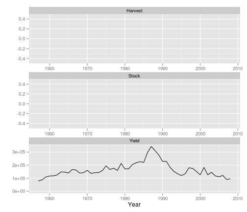

Biomass dynamic models with FLBioDym
=========================
Ispra, 18th - 22nd March, 2013
-------------------------

# Install FLBioDym


```r
install.packages("FLBioDym", repos = "http://flr-project.org/Rdevel")
```


# FLBioDym

* Pella-Tomlinson (generalizes biomass dynamic models)
    * Schaeffer with $p=1$
    * Fox with $p \sim 0$

* Interfaces with ADMB for model fit

# Example


```r
library(FLBioDym)
```

```
## Loading required package: FLCore
```

```
## Loading required package: grid
```

```
## Loading required package: lattice
```

```
## Loading required package: MASS
```

```
## FLCore 2.5.0 development version
```

```
## Attaching package: 'FLCore'
```

```
## The following object(s) are masked from 'package:base':
## 
## cbind, rbind
```

```
## Loading required package: FLash
```

```
## Loading required package: ggplotFL
```

```
## Loading required package: ggplot2
```

```
## Need help? Try the ggplot2 mailing list:
## http://groups.google.com/group/ggplot2.
```

```
## Attaching package: 'ggplot2'
```

```
## The following object(s) are masked from 'package:FLCore':
## 
## %+%
```

```
## Attaching package: 'ggplotFL'
```

```
## The following object(s) are masked from 'package:FLCore':
## 
## catchSel
```

```
## Loading required package: FLAdvice
```

```
## Loading required package: akima
```

```
## Loading required package: plyr
```

```
## Attaching package: 'plyr'
```

```
## The following object(s) are masked from 'package:FLCore':
## 
## desc
```

```
## Attaching package: 'FLBioDym'
```

```
## The following object(s) are masked from 'package:FLAdvice':
## 
## hcr, msy
```

```r
data(ple4)
ple4.bd <- FLBioDym(catch = catch(ple4), index = stock(ple4))
```


```r
plot(ple4.bd)
```

 

